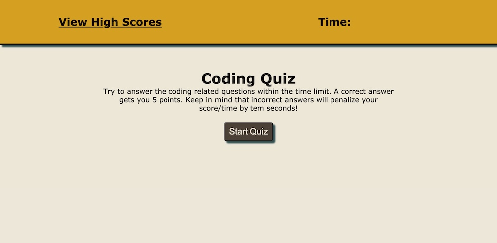

# 04-Homework-Coding-Quiz

## Your Task
Create a dynamically generated quiz based on Coding Questions.  This quiz should keep score, keep a timer that is modified based on accuracy of questions as well as maintain a High Score list.  The user should be able to enter their initials upon completion of game to add to High Score.

## Criteria
    - Have a start button to being game
    - Create a timer that ends the game when it reaches zero.
    - Questions populate page as they are answered, if answered incorrectly time is removed from "clock"
    - Create and maintain a High Score leaderboard using Local Storage.

## Final Product

 https://tallen1985.github.io/04-Homework-Code-Quiz/]